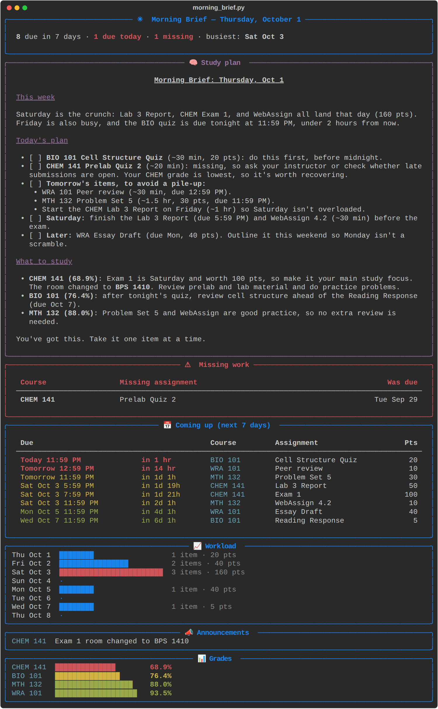

# Canvas Bot — Automated Morning Brief

Every morning, pulls what's due from Canvas and builds you an interactive dashboard
(it opens in your browser) plus a short text brief for your phone or email:

- ⚠️ **Missing** work
- 📅 Everything **due in the next 7 days** (skips stuff you already submitted)
- 📣 Recent **announcements**
- 📊 Current **grades** (lowest first)
- ✅ **Do today**: a checklist of what to work on today, with time estimates (tick things off; it remembers)
- 📈 **Grade history** chart for every class, plus **recent grade changes** (which assignment moved your grade, and by how much)
- 🧠 Optional **AI study plan** (via Claude): plans your day and what to study

The dashboard has a workload chart (click a day to filter), course filters,
live countdowns, links straight to each assignment in Canvas, and dark mode.
It's saved as `dashboard.html` in the bot's folder. Bookmark it, and every
run refreshes it.



Delivered by **email**, **Discord**, and/or **phone push notification** (ntfy).

## ⚡ Quick start (Windows)

1. Download this repo (green **Code** button → **Download ZIP**), extract it, and
   move the folder somewhere permanent, like `Documents\Canvas-Bot`.
2. Install [Python](https://www.python.org/downloads/) (tick **Add python.exe to PATH**).
3. Double-click **`setup_windows.bat`** and follow the prompts. It installs everything,
   has you paste your Canvas address and WeBWorK/Labflow links, logs you in once, sets it to
   run every time you log in, and builds your first dashboard.
4. Optional: install [Claude Code](https://claude.com/claude-code) for the AI "Do today" plan.

The rest of this page explains each piece in detail.

## Something not working?

Run this in the bot's folder:

```
python morning_brief.py --check
```

It tests each piece (your `.env`, the Canvas login, your settings file, each
WeBWorK/Labflow link) and says in plain English what's wrong. If your links look
right, it opens WeBWorK and Labflow in a visible browser so you can watch what
happens. The output contains no passwords or keys, so it's safe to share.

## 1. Connect Canvas

There are three ways. If your school blocks access tokens and third-party apps
(the "New Access Token" button is greyed out), use **Option A**.

### Option A — Your own browser login (full data, no token needed) ⭐

The script opens a normal browser window, you log in once (SSO, Duo, all of
it), and it saves that login to reuse every morning. It reads the same data
the Canvas website shows you, so you get everything: what's due, what you've
already submitted, missing work, grades, and announcements.

```bash
pip install -r requirements.txt
python -m playwright install chromium   # one-time browser download
# put CANVAS_BASE_URL=https://yourschool.instructure.com in .env
python morning_brief.py --login
```

- The saved login lives at `~/.canvas-bot/session.json`. **Anyone with that file
  is logged in as you**, so never commit, share, or upload it.
- Your school decides how long a login lasts. When it runs out, the brief tells
  you to run `--login` again. If you also set `CANVAS_ICS_URL`, you still get
  due dates in the meantime.
- It only *reads* your own data, a handful of requests a day (less than opening
  Canvas once). Still, check your school's IT acceptable-use policy.
- This option runs on **your computer** (see step 3b), not GitHub Actions.

### Option B — Calendar Feed (works even if access tokens are greyed out)

1. Open Canvas → **Calendar** (left sidebar)
2. At the bottom of the right-hand column, click **Calendar Feed**
3. Copy the link (looks like `https://yourschool.instructure.com/feeds/calendars/user_abc123.ics`)
4. Use it as `CANVAS_ICS_URL`. It's a private link, so don't share it.

The feed has every assignment/quiz due date and class event, but **not** whether
you've submitted something, missing work, grades, or announcements. Turn on
Canvas **Notifications** (Account → Notifications → email/push) for those.

### Option C — Access token (more detail, if your school allows it)

Canvas → **Account** → **Settings** → **Approved Integrations** → **+ New Access Token**.
Set `CANVAS_BASE_URL` (e.g. `https://yourschool.instructure.com`) and `CANVAS_TOKEN`.
This adds submission status, missing work, grades, and announcements.

## AI study plan (optional)

The Do today plan and What to study sections are written by Claude. Without it, Do today is built from simple rules (missing work, things due within 36 hours, a head start on your busiest day). There are two ways to power it:

- **Your Claude subscription (Pro/Max):** install [Claude Code](https://claude.com/claude-code) on the
  same computer and log in once:
  - Windows (PowerShell): `irm https://claude.ai/install.ps1 | iex`
  - Mac/Linux: `curl -fsSL https://claude.ai/install.sh | bash`
  - Then run `claude` once, log in with your Claude account, and type `/exit`.

  The bot finds the `claude` command automatically. Each brief uses a small amount of your
  plan's usage. Claude only reads the brief text; it can't run commands or touch files.
- **API key:** set `ANTHROPIC_API_KEY` in `.env` (from console.anthropic.com, billed separately,
  a few cents per brief). This is the only option for GitHub Actions.

Use `--no-ai` to skip it.

Grade history needs Option A or C below; the calendar feed doesn't include grades.

## Your settings: WeBWorK, Labflow, reminders, hobbies, pictures

Copy `my_settings.example.json` to `my_settings.json` and edit it (Notepad is fine).

- **WeBWorK / Labflow**: these only open from a link inside Canvas, so the bot
  opens that same Canvas link in a hidden browser (using your `--login`) and reads
  the assignments. In Canvas, right-click the WeBWorK or Labflow link, choose
  **Copy link address** (or open the tool's page in Canvas, like "Labflow App" in
  Modules, and copy the address bar), and paste it as `canvas_link`. If Canvas shows
  a "Load … in a new window" button, that's fine: the bot clicks it. Use the Canvas link, not the
  webwork3/labflow address it takes you to (those contain short-lived login keys).
  WeBWorK doesn't show whether a set is finished, so tick it off on the dashboard.
  WeBWorK sits behind MSU's own login (NetID + Duo), which expires often. When it
  does and you're at the computer, a browser window opens for you to sign in;
  otherwise the dashboard shows the WeBWorK sets from the last successful check.
  If a site can't be read, the dashboard says so and screenshots go in `debug/`.
- **Reminders**: extra to-dos based on Canvas items. The example adds "Post your
  Packback discussion question" one day before any Packback assignment in GPHY.
  Change `match_course` to your course code as it appears on the dashboard.
- **Hobbies**: one is featured each day as your reward for finishing your list.
- **Pictures**: drop your own photos (mountains, hobbies…) into the `photos/`
  folder and a different one shows each day. With none, the dashboard draws a new
  mountain scene every day. **Quotes** rotate daily; add your own in settings.

## Run it automatically when you turn on your PC (Windows)

1. Move the bot's folder somewhere permanent first (e.g. `Documents\Canvas-Bot`).
2. In PowerShell, in that folder, run:
   ```
   python morning_brief.py --install-startup
   ```
That's it. When you log in, the brief runs once (the first login of the day),
waits for Wi-Fi if needed, and opens your dashboard. Later logins that day just
reopen it. A **Refresh Morning Brief** shortcut also appears on your Desktop for
updating it anytime. To undo: `python morning_brief.py --remove-startup`.

## 2. Try it locally

```bash
pip install -r requirements.txt
cp .env.example .env      # fill in CANVAS_ICS_URL (or CANVAS_BASE_URL + CANVAS_TOKEN)
python morning_brief.py --dry-run
```

## 3a. Run it every morning in the cloud (calendar feed / token only)

1. In this repo on GitHub: **Settings → Secrets and variables → Actions**
2. Add **secrets**: `CANVAS_ICS_URL` (or `CANVAS_BASE_URL` + `CANVAS_TOKEN`), plus any delivery ones you want:
   - Email: `SMTP_HOST`, `SMTP_USER`, `SMTP_PASSWORD`, `EMAIL_TO`
     (Gmail: `smtp.gmail.com`, and create an [App Password](https://myaccount.google.com/apppasswords))
   - Discord: `DISCORD_WEBHOOK_URL` (Channel → Edit → Integrations → Webhooks)
   - Phone push: `NTFY_TOPIC` — install the [ntfy app](https://ntfy.sh), subscribe to a long random topic name
   - AI study plan: `ANTHROPIC_API_KEY` (from <https://console.anthropic.com>)
3. Optionally add **variables**: `TIMEZONE` (e.g. `America/Denver` for Montana), `DAYS_AHEAD`
4. Edit the `cron` time in `.github/workflows/morning-brief.yml` (it's in UTC)
5. Test: **Actions → Morning Brief → Run workflow**

> Keep the repo **private** — the workflow logs print your brief.

## 3b. Run it every morning on your own computer (needed for Option A)

Your computer has to be on (or asleep but able to wake) at that time.

**Windows** (Task Scheduler). Run this in Command Prompt, fixing the paths:

```bat
schtasks /Create /TN "Canvas Morning Brief" /SC DAILY /ST 07:30 ^
  /TR "\"C:\Path\To\python.exe\" \"C:\Path\To\Canvas-Bot\morning_brief.py\""
```

(`where python` shows your Python path.) Then open Task Scheduler, find the task,
and under **Settings** tick *"Run task as soon as possible after a scheduled
start is missed"* so it catches up if your PC was off.

**Mac / Linux** (cron). Run `crontab -e` and add:

```
30 7 * * * cd /path/to/Canvas-Bot && /usr/bin/python3 morning_brief.py
```
